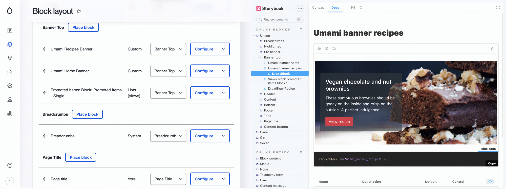

# DruxtBlocks

The DruxtBlocks module adds Drupal Blocks, Block Region and Custom content Blocks Vue.js components to your [Nuxt.js](https://nuxtjs.org) frontend.


## Features

- [Nuxt module](#nuxt-module)
- [DruxtBlock component](#druxtblock-component)
- [DruxtBlockRegion component](#druxtblockregion-component)
- [Druxt Module wrapper theming support](#druxtwrapper-theming)
- [Druxt Module settings](#module-settings)
- [Auto-generated Nuxt Storybook integration](#storybook)


## Nuxt module

The DruxtBlocks module provides Vue.js components and a Nuxt module, among other things.

The Nuxt module installs all required components and dependencies, however most components can be used individually in any Node project.

```js
module.exports = {
  modules: ['druxt-blocks'],
  druxt: { baseUrl: 'https://demo-api.druxtjs.org' },
}
```

See [Getting started](/guide/getting-started) and the [API documentation](/api) for more details.


## DruxtBlock component

The `DruxtBlock` component renders a single Drupal Block by ID or UUID.

```vue
<DruxtBlock :id="drupal_internal__id" />
```

```vue
<DruxtBlock :uuid="uuid" />
```

See the [DruxtBlock component API documentation](../api/components/DruxtBlock).


## DruxtBlockRegion component

The Block Region component renders all Drupal blocks in a specified region, with support for Drupal's visibility settings.

```vue
<DruxtBlockRegion :name="name" :theme="theme" />
```


See the [DruxtBlockRegion component API documentation](../api/components/DruxtBlockRegion).


## DruxtWrapper theming

Druxt modules use a slot-based Wrapper component system to provide rich defaults while still allowing full control over all theming and functionality.

See the [theming guide](https://druxtjs.org/guide/theming.html) for more details.


## Module settings

### Reducing Block data

The default behaviour of the Block module is to retrieve all available fields from the JSON:API.

This behaviour is configurable using the modules `query` option, allowing for manually filtered `fields`.

The default behaviour can be set via `nuxt.config.js`:
```js
druxt: {
  blocks: {
    query: {
      fields: ['dependencies'],
    },
  },
}
```


## Storybook

DruxtBlocks provides zero-config, auto generated Storybook integration with a live data connnection to your Druxt backend.



See [Gettings started](/guide/getting-started) for more information.
